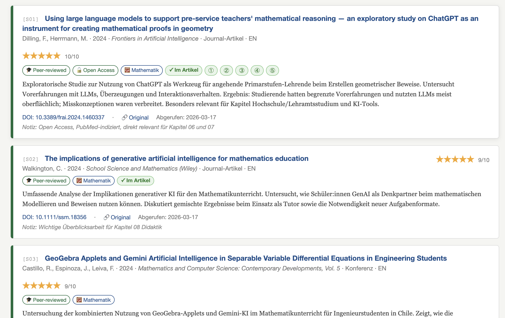
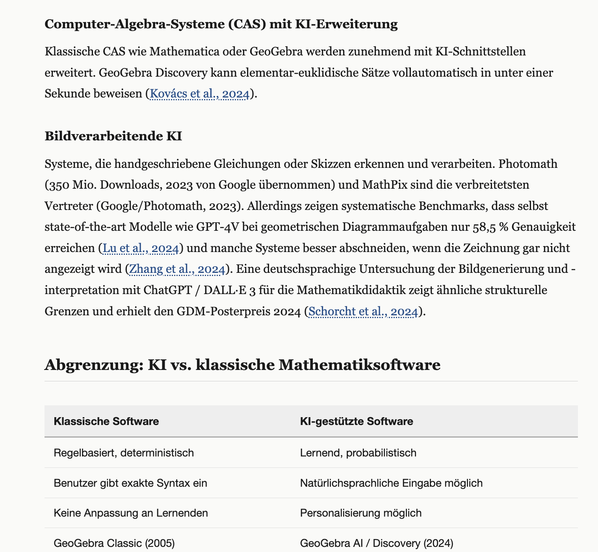
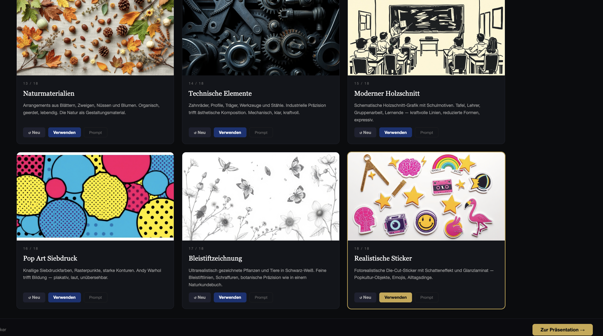

# Claude Research

**A complete AI-assisted workflow for scientific articles — from literature review to publication-ready output.**

Built entirely inside VS Code with Claude Code. No specialist software, no complex setup — just a folder, an editor, and a conversation.

---

## What this is

Claude Research is a template that turns VS Code + Claude Code into a full scientific research environment:

- **Automated literature research** — Claude searches, evaluates and structures sources with authority, recency and relevance scores
- **Interactive citation system** — every inline citation `(Author, Year)` is a live hyperlink; sources are a queryable, filterable database with DOI links, open-access badges and topic clusters. Print and static PDFs can't do this.
- **Article writing** — 10-chapter structure in Markdown, APA 7 citations, Austrian/German academic style
- **Publication-ready export** — `build.py` generates `standalone.html` (interactive, printable) and `standalone.tex` (LaTeX/Overleaf-ready)
- **Presentation** — Reveal.js slides with AI-generated background images (fal.ai Flux), 3 layout modes, 8 font themes, 18 visual styles

---

## Screenshots

**Quellenverzeichnis — Stats & Filter**


**Quellkarten mit Badges, Zitierlinks und APA-Copy-Button**


**Bewertungsmethodik**


**Artikeltext mit klickbaren Inline-Zitaten**


**Literaturverzeichnis mit Badges**


**Präsentationsfolie (Sticker-Stil, Reveal.js)**


**Bildstil-Galerie (`stile.html`)**


---

## Requirements

| What | Why |
|---|---|
| [VS Code](https://code.visualstudio.com) | Editor |
| [Claude Code extension](https://marketplace.visualstudio.com/items?itemName=Anthropic.claude-code) | AI assistant — includes CLI, no Node.js needed |
| [Python 3](https://python.org) | For `build.py` (HTML + LaTeX export) |
| [fal.ai API Key](https://fal.ai/dashboard/keys) | For AI-generated slide images (optional) |

---

## Getting started

1. Clone or download this repository
2. Open the folder in VS Code
3. Start Claude Code (`claude` in the terminal or via the extension)
4. Type **„Leg los"** — Claude will ask 9 questions and then build everything autonomously

---

## API Key setup

Enter your fal.ai key in `API Key.js`:

```js
window.FAL_KEY = "your-key-here";
```

Then protect it from accidental commits:

```bash
git update-index --skip-worktree "API Key.js"
```

---

## Project structure

```
claude-research/
├── CLAUDE.md               ← Instructions for Claude Code
├── build.py                ← Build script → standalone.html + .tex
├── API Key.js              ← fal.ai key (fill in, then skip-worktree)
├── content/                ← Article chapters (Markdown)
├── sources/sources.json    ← All sources with metadata
├── assets/css/paper.css    ← Stylesheet
├── presentation/
│   ├── index.html          ← Reveal.js presentation
│   └── stile.html          ← Visual style gallery for slides
└── figures/                ← Images for the article
```

---

## License

MIT © 2026 Thomas Schroffenegger
Brought to life with the rather delightful help of [Claude Code](https://claude.ai/code) (Anthropic)
