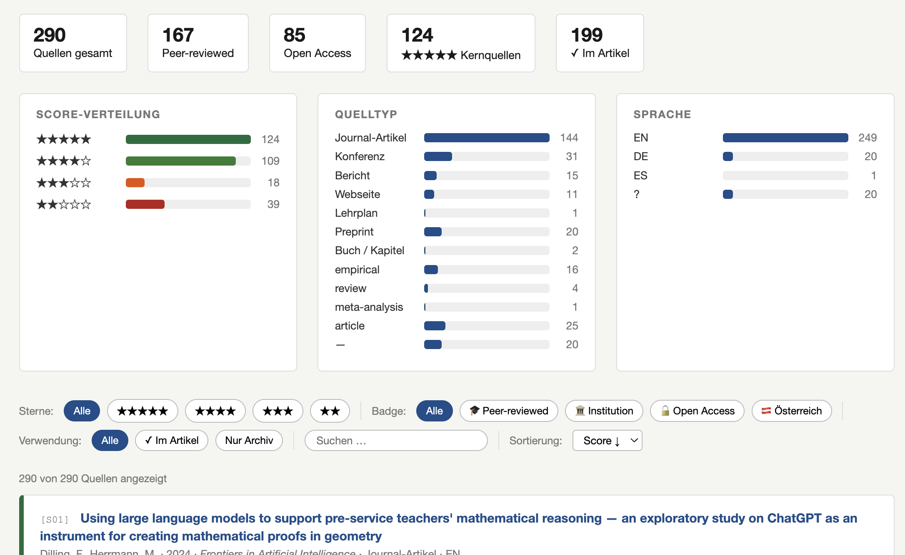
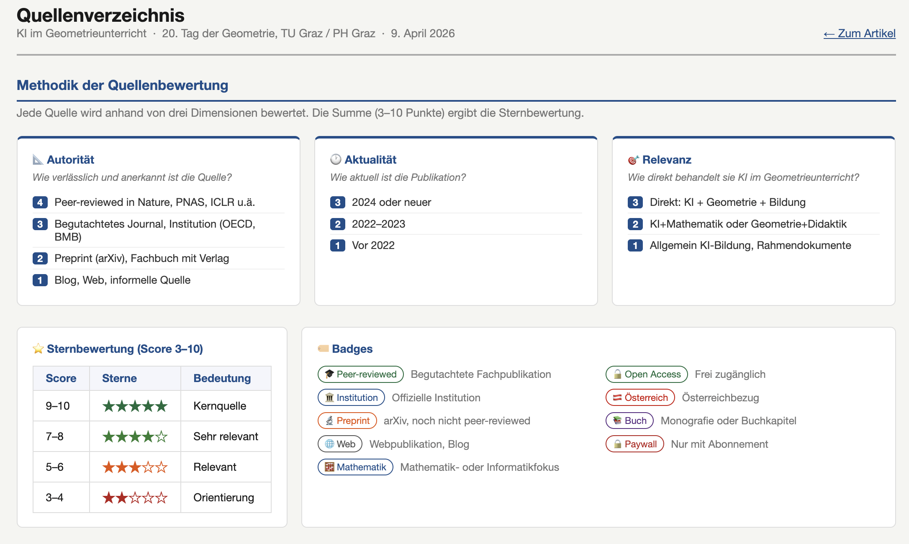
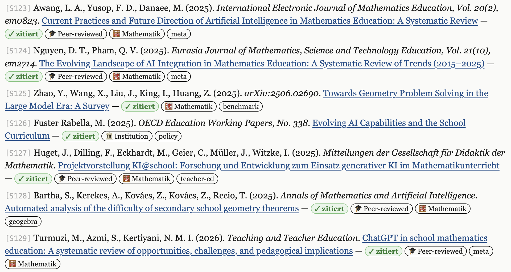
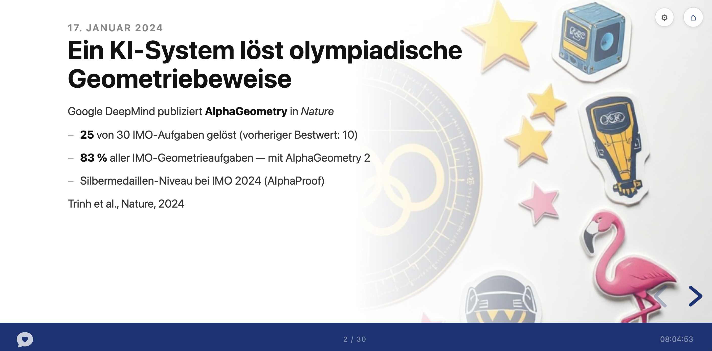

# Claude Research

**A complete AI-assisted workflow for scientific articles — from literature review to publication-ready output.**

Built entirely inside VS Code with Claude Code. No specialist software, no complex setup — just a folder, an editor, and a conversation.

---

## What this is

Claude Research is a template that turns VS Code + Claude Code into a full scientific research environment:

- **Automated literature research** — Claude searches, evaluates and structures sources with authority, recency and relevance scores
- **Interactive citation system** — every inline citation `(Author, Year)` is a live hyperlink; sources are a queryable, filterable database with DOI links, open-access badges and topic clusters
- **Article writing** — 10-chapter structure in Markdown, APA 7 citations, Austrian/German academic style
- **Publication-ready export** — `build.py` generates `standalone.html` (interactive, printable) and `standalone.tex` (LaTeX/Overleaf-ready)
- **Presentation** — Reveal.js slides with AI-generated background images (fal.ai Flux), 3 layout modes, 8 font themes, 18 visual styles
- **PowerPoint export** — one-click `.pptx` generation with editable text and embedded background images
- **Source download manager** — automated PDF download for open-access sources, excerpt extraction for paywalled content
- **Course mode** — optional syllabus generation with schedule, learning outcomes, required readings and a sample PowerPoint for the first session

---

## Screenshots

### Source Database

**Statistics dashboard — 290 sources, peer-review rate, score distribution, type and language breakdown**


**Source cards with score badges, citation links and full metadata**


**Rating methodology — authority, recency and relevance dimensions explained**


### Article

**Article text with clickable inline citations — every (Author, Year) links to the source**


**Source list with badges, citation status and DOI links**


### Presentation

**Reveal.js slide with AI-generated sticker-style background (fal.ai Flux)**


**Visual style gallery — 18 styles, one click to switch**


---

## Requirements

| What | Why |
|---|---|
| [VS Code](https://code.visualstudio.com) | Editor |
| [Claude Code extension](https://marketplace.visualstudio.com/items?itemName=Anthropic.claude-code) | AI assistant — includes CLI, no Node.js needed |
| [Python 3](https://python.org) | For `build.py` (HTML + LaTeX export) |
| [fal.ai API Key](https://fal.ai/dashboard/keys) | For AI-generated slide images (optional) |

---

## Getting started

1. Clone or download this repository
2. Open the folder in VS Code
3. Fill in `content/meta.json` (title, author, event, sources target, etc.) — or let Claude ask you
4. Start Claude Code (via the extension panel)
5. Type **"Leg los"** — Claude reads your `meta.json` and builds everything autonomously

> **What happens next:** Claude researches sources, writes 10 chapters, creates the presentation, verifies all URLs, and hands you the finished article. No questions asked — it works through all 9 steps in one go.

---

## API Key setup

Enter your fal.ai key in `API Key.js`:

```js
window.FAL_KEY = "your-key-here";
```

Then protect it from accidental commits:

```bash
git update-index --skip-worktree "API Key.js"
```

---

## Project structure

```
claude-research/
├── CLAUDE.md               ← Instructions for Claude Code (the brain)
├── build.py                ← Build script → standalone.html + .tex
├── API Key.js              ← fal.ai key (fill in, then skip-worktree)
├── index.html              ← Landing page with links to all outputs
├── handbuch.html           ← User manual (German)
├── syllabus.html           ← Course syllabus template (optional)
├── content/
│   ├── meta.json           ← Project metadata (title, author, sources target)
│   └── 01–10_*.md          ← Article chapters (Markdown)
├── sources/
│   ├── sources.json        ← All sources with metadata and scores
│   └── pdf/                ← Downloaded source PDFs (auto-populated)
├── assets/css/paper.css    ← Stylesheet
├── presentation/
│   ├── index.html          ← Reveal.js presentation with FAB toolbar
│   ├── stile.html          ← Visual style gallery (18 styles)
│   └── fonts/              ← Local font files (GDPR-compliant)
└── figures/                ← Images for the article
```

---

## Features at a glance

| Feature | How |
|---|---|
| Literature research | Claude searches, evaluates, scores (3–10) and categorizes sources |
| Interactive citations | Click any `(Author, Year)` → popup with abstract, DOI, badges |
| Source quality dashboard | Filter by score, type, badge, language; visual statistics |
| APA 7 compliance | Inline citations auto-linked, chapter bibliographies generated |
| URL verification | Every source URL checked for accessibility |
| PDF download | Open-access PDFs saved locally; paywall → excerpt extraction |
| HTML article | Responsive, printable, with TOC and citation modals |
| LaTeX export | Overleaf-ready `.tex` (color + b/w variants) |
| Reveal.js presentation | 3 layouts, 8 fonts, 18 AI image styles, gradient mode |
| PowerPoint export | `.pptx` with editable text and embedded backgrounds |
| Deployment ZIP | Self-contained package for any web server |
| Course mode | Syllabus + schedule + sample PowerPoint for first session |

---

## License

MIT © 2026 Thomas Schroffenegger
Brought to life with the rather delightful help of [Claude Code](https://claude.ai/code) (Anthropic)